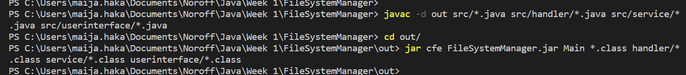

# File System Manager

A command line application for requesting information about the files in the projects resources folder located at /src/resources.

## Building and packaging:

Compile and package the project with the following commands in the root directory of the project:

Additionally, the resources should be copied from /src/resources to /out/resources:

## Running

Run the program with the following command in the /out directory of the project:

This opens a menu of available operations.